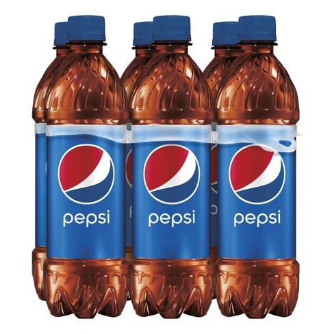
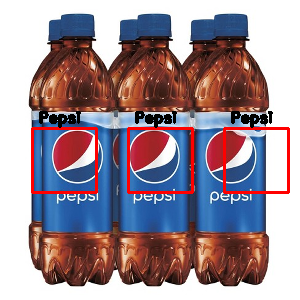
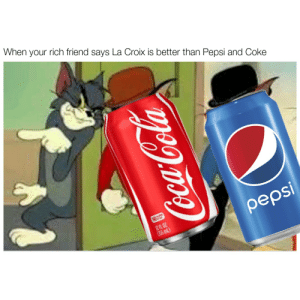
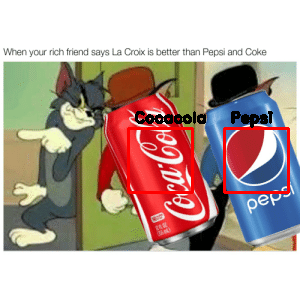

# Logo Recognition
Author: [Xipeng Xie](https://github.com/Ageneinair)

This repository is a demo for detect and recognize logo in the image.
The dataset I used is [Flickr Logos 27 dataset](http://image.ntua.gr/iva/datasets/flickr_logos/), which contain 27, but in this demo, only Pepsi and CocaCola would be detect.

## Demo

### original:

### aftet detector:

### original:

### aftet detector:

